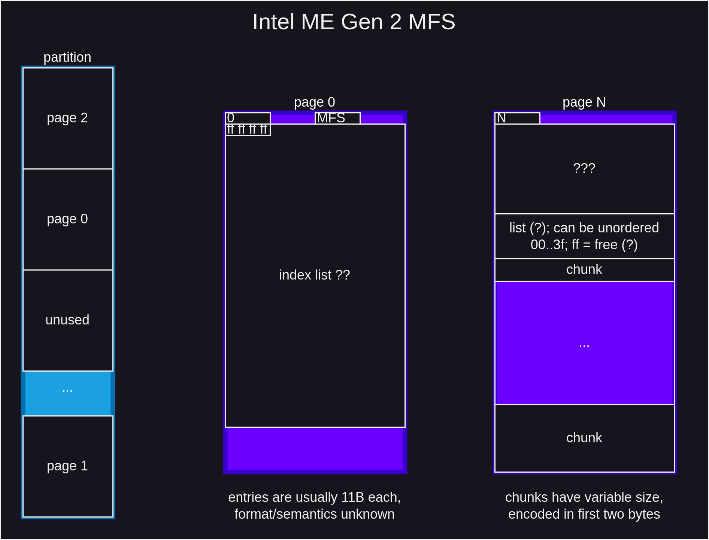

# ME Gen 2 MFS

...

## page header

- xxx7 may mean unused/dirty, xxxC live, xxxE live and ... smth?

## chunk

- X only occurs in first chunk of some pages, mostly later pages
- first chunk is always X or F (some letter, i.e. active/live(?))

